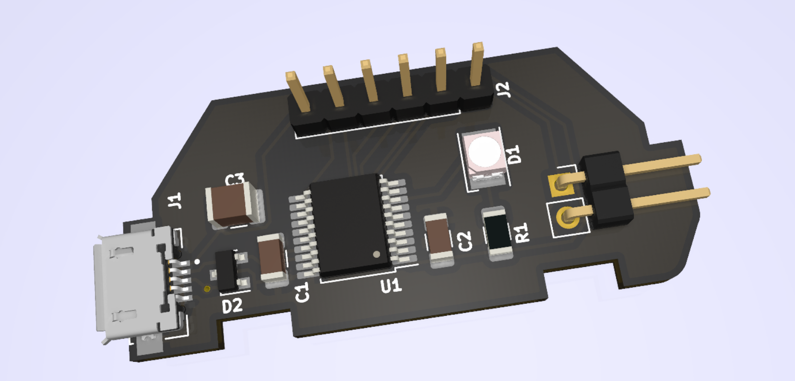
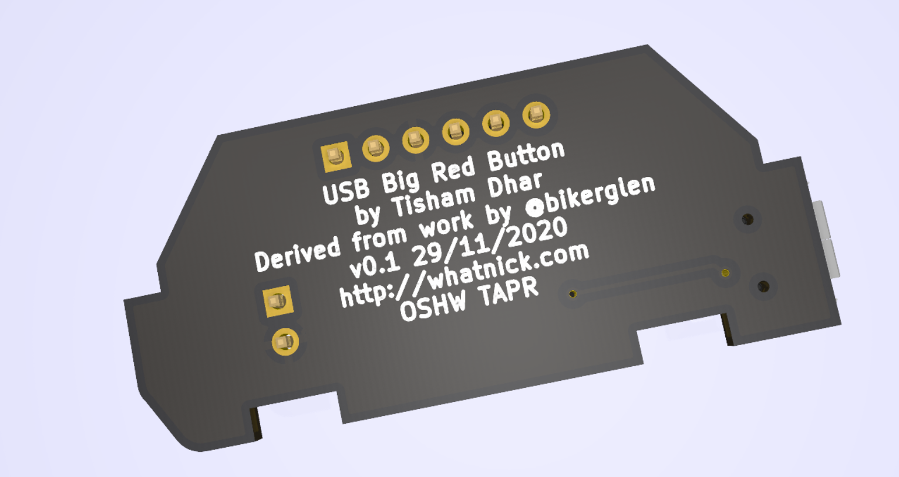

# KiCAD port of USB Big Red Button Project
- Imported from Eagle version of files on 28/11/2020
- Added STL enclosure / PCB carries 24/12/2020
- For mechanical designs in Fusion 360 refer to original repository
- For software refer to original repository

## Renders

## Direct Order for PCB/BOM

- Order PCB via [OSHPark](https://oshpark.com/shared_projects/303OZMds)
- Order BOM via [Digikey](https://digikey.com.au/short/z10044)

## Credits

- Original design by [@bikerglen](https://twitter.com/bikerglen)
- KiCAD port by [@whatnick](https://twitter.com/whatnick)
- 3D prints by [@tweety_belle](https://twitter.com/tweety_belle) and [SANE Makerspace](http://www.sanemakerspace.com/)
